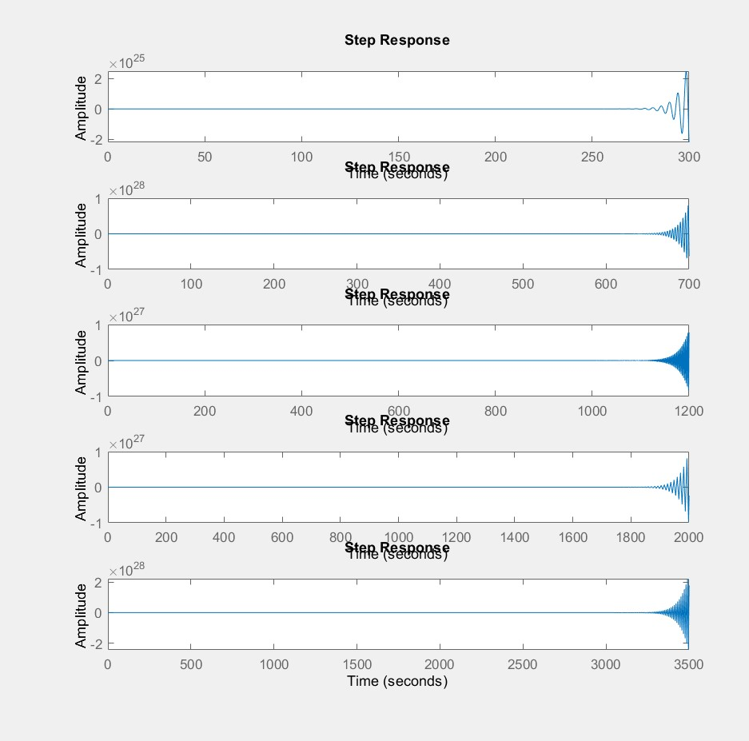
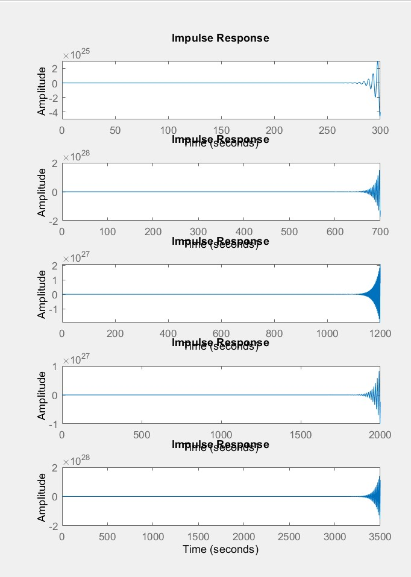
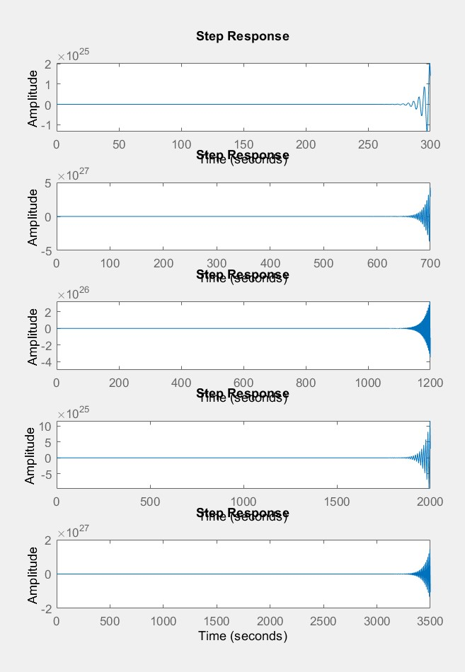
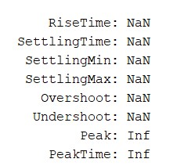

Nama : Isnan Firmansyah

NIM : 19/445567/PA/19391


[https://github.com/isnn/matlab_controlSystem/tree/main/integral%20effect%20control](https://github.com/isnn/matlab_controlSystem/tree/main/integral%20effect%20control)

```
% Declare variable
s = tf('s');

Kp= 1;
Ti = 3;

Ki = Kp/Ti;
Ki = 0;

T =1; 
num = 1;
den = [T T/16 1];    
sys = tf(num, den) % system without PI 

sys_c = tf([Ki Kp], [1 0]) % Kp & Ki
sys_c = tf([Kp]) % Kp only

complete = feedback(sys*sys_c, 1) % all signal after feedback

step(complete) %step response
impulse(complete) %impulse response
step(complete/s) %ramp response

stepinfo(complete)
% xlim([0 500]) 
% ylim([-2 2])
```

Task  
1. visualisasikan response untuk beberapa Kp dan Ki

  stepresponse
  
  
  impulseresponse
  
  
  
  rampresponse
  
  
    
2. analisis dari setiap responnya
  
  analysisresponse
  
  
